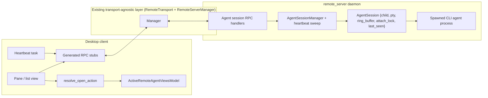
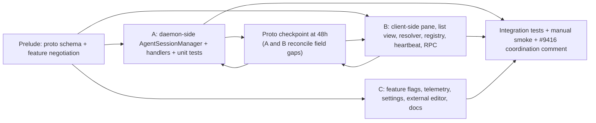

# Persistent Remote CLI Agent Sessions — Technical Spec

Companion to `PRODUCT.md` in this directory. References `PRODUCT.md` behavior numbers (P-N) where relevant.

## Context

A CLI agent (Claude Code, Codex, Gemini CLI, OpenCode) launched inside a Warp SSH tab today is anchored to the desktop client through a chain of resources that all die together:

- **Client-side connection state**: `RemoteSessionState` (`crates/remote_server/src/manager.rs:279`) owns a `Child` for the SSH process. Drop ⇒ `kill_on_drop` ⇒ SIGKILL. `deregister_session` (`manager.rs:1273`) is the entry point that drops this.
- **Transport**: `RemoteTransport` trait (`crates/remote_server/src/transport.rs:184`). Object-safe by design. Comment-documented as "transport-agnostic session lifecycle managed by `RemoteServerManager`. Alternative transports (Docker exec, in-process for tests) implement the same trait without touching the manager." This is the seam v2 (HTTP/WS for PWA) reuses.
- **Daemon side**: `remote_server`'s daemon runs on the host, supervised independently of the SSH connection (Unix socket, version-aware via PR #10782). The daemon's per-connection session is torn down when the SSH transport drops; any PTY it spawned dies with it.
- **PTY plumbing**: `pty_controller` + `RemoteServerController` (`app/src/terminal/writeable_pty/remote_server_controller.rs`) wire the byte stream from the remote PTY into the terminal model. The model and the ANSI parser are agnostic to the PTY source.
- **CLI agent observation**: `CLIAgentSessionListener` (`app/src/terminal/cli_agent_sessions/listener/mod.rs:175-189`) subscribes to `ModelEvent::PluggableNotification`, fed by OSC 9277 / OSC 9 parsing in the terminal model. Source of bytes is invisible to it.
- **Existing PTY-server template**: `TerminalServer` in `app/src/terminal/local_tty/server/` (`mod.rs:117-218`, `ServerOwnedPtyHandle` at line 222) spawns a forked PTY server over a Unix socket with bincode-framed messages — the abstract shape of "PTY whose lifecycle is owned by another process". Its `Drop` (`mod.rs:212-218`) kills the server today; we do not modify it, only use it as a structural reference.

The protocol (`crates/remote_server/proto/remote_server.proto`) has messages for shell bootstrap, command execution, buffer sync, and directory navigation. It has no messages for `attach`, `detach`, `list_sessions`, or any concept of a session that outlives the client. This is the gap.

## Proposed changes

### Three layers, kept separate

| Layer | What lives here | Status |
|-------|-----------------|--------|
| Transport (`RemoteTransport` + `RemoteServerManager`) | SSH/HTTP/WS channel between desktop and daemon | Unchanged in behavior; we add proto messages that travel through |
| Connection (`RemoteSessionState`, daemon per-connection state) | One active client↔daemon connection, tied to the SSH process | Unchanged |
| Agent session (new) | `AgentSession` in daemon: child + PTY + ring buffer + attach lock, independent of any single client | New code lives here |

The connection layer's lifecycle events are *hints* to the agent layer, never authority. Authority for "is this client still here?" is the application-level heartbeat (see "Heartbeat" below).

### New module: `crates/remote_server/src/agent_sessions/`

```rust
// agent_sessions/mod.rs

pub struct AgentSessionManager {
    sessions: tokio::sync::RwLock<HashMap<SessionId, Arc<AgentSession>>>,
    ended_lru: tokio::sync::Mutex<VecDeque<SessionId>>, // for MAX_ENDED_SESSIONS eviction
}

pub const MAX_ENDED_SESSIONS: usize = 20;

pub struct AgentSession {
    id: SessionId,
    label: tokio::sync::RwLock<String>,
    meta: SessionMeta, // cmd, args, cwd, agent_kind, started_at — immutable
    state: tokio::sync::RwLock<SessionState>,
    output_buffer: tokio::sync::Mutex<RingBuffer>,
    output_tx: tokio::sync::broadcast::Sender<BytesChunk>,
    attach_lock: tokio::sync::Mutex<Option<AttachedClient>>,
    pty: tokio::sync::Mutex<Option<PtyHandle>>, // None after Ended
    _supervisor: tokio::task::JoinHandle<()>,
}

pub enum SessionState {
    Running { pid: u32 },
    Ended { exit: ExitDescriptor, ended_at: SystemTime },
}

pub struct AttachedClient {
    client_id: ClientId,
    last_seen: tokio::sync::Mutex<Instant>,   // updated on every heartbeat
    detach_tx: oneshot::Sender<DetachReason>,
}

pub enum DetachReason {
    ClientRequested,
    Superseded { by_client: ClientId },
    HeartbeatTimeout,
    DaemonShuttingDown,
}
```

Public API (invoked by any transport's handler):

```rust
impl AgentSessionManager {
    pub async fn start(&self, req: StartRequest) -> Result<StartedSession, StartError>;
    pub async fn list(&self) -> Vec<SessionSummary>;
    pub async fn attach(
        &self,
        id: SessionId,
        client_id: ClientId,
        from_offset: Option<u64>,
        cols: u16,
        rows: u16,
    ) -> Result<AttachStream, AttachError>;
    pub async fn heartbeat(&self, id: SessionId, client_id: ClientId) -> Result<(), HeartbeatError>;
    pub async fn detach(&self, id: SessionId, client_id: ClientId) -> Result<(), DetachError>;
    pub async fn kill(&self, id: SessionId) -> Result<(), KillError>;
    pub async fn rename(&self, id: SessionId, new_label: String) -> Result<(), RenameError>;
    pub async fn send_input(&self, id: SessionId, client_id: ClientId, bytes: Bytes) -> Result<(), InputError>;
    pub async fn resize(&self, id: SessionId, cols: u16, rows: u16) -> Result<(), ResizeError>;

    /// Dogfood-only RPC; gated behind FeatureFlag::RemoteAgentSessionsDebug.
    pub async fn inspect(&self, id: SessionId) -> Result<SessionInspection, InspectError>;
}

pub struct SessionInspection {
    pub ring_buffer_bytes: usize,
    pub ring_buffer_truncations: u64,
    pub attach_history: Vec<AttachHistoryEntry>,
    pub last_heartbeat_seen: Option<SystemTime>,
    pub child_status: ChildStatusDescriptor,
}
```

`AttachStream` emits: one `Snapshot { bytes, truncated_from_start, current_offset }`, zero-or-more `Live { bytes, offset }`, then exactly one terminal event (`Detached { reason }` or `SessionEnded { exit }`).

Child spawning uses `portable-pty` (already a workspace dep). `setsid` is set in `pre_exec` so SIGHUP from the parent's terminal does not cascade. The supervisor task reads the PTY master, pushes to `output_buffer` and `output_tx`, and awaits child exit; on exit, transitions state to `Ended`, releases the PTY master, and registers the id with `ended_lru`. If `ended_lru` grows beyond `MAX_ENDED_SESSIONS`, the oldest ended id is evicted from `sessions` (only if its state is `Ended` and it has no attached client — running sessions are never evicted).

Kick semantics: a new `attach` `take()`s the previous `attach_lock`, fires its `detach_tx` with `Superseded`, then installs the new client — single critical section, no race in the synchronous path. The asynchronous case (previous client lost network without detach) is handled by the heartbeat below.

### Heartbeat: application-level liveness

The transport layer cannot be trusted to release attach locks promptly. TCP keepalive may take minutes; an SSH session in the middle of a partition may stay open on the daemon side while the client side has been gone for a while. Without an application-level signal, a kicked client coming back from a network blip would not actually be displaced.

**Mechanism**:
- Attached client sends `HeartbeatAgentSessionRequest { session_id }` every 10 seconds.
- Daemon updates `AttachedClient::last_seen` on receipt.
- A background task in `AgentSessionManager` scans all attached clients every 5 seconds. For any whose `last_seen` is older than 25 seconds (2 missed heartbeats + slack), it releases the `attach_lock` with `DetachReason::HeartbeatTimeout`, sends the typed event over the broadcast (best-effort — the client may not be listening), and emits a telemetry event.
- The client's transport-disconnect events (SSH socket EOF) are *hints*: they cause the daemon's session handlers to log the disconnect and stop forwarding bytes for that client, but they do **not** call into `AgentSessionManager` to release locks. Only the heartbeat sweep does.

The 10s/25s pair is the v1 default; a single constant in `agent_sessions/mod.rs` lets us tune without protocol changes.

### Ring buffer: ANSI-safe truncation

```rust
pub struct RingBuffer {
    buf: VecDeque<u8>,
    cap: usize, // 4 MiB constant for v1
    total_written: u64, // monotonic; offset returned to clients
    truncations: u64,   // for InspectAgentSession + telemetry
}

impl RingBuffer {
    pub fn push(&mut self, bytes: &[u8]);
    pub fn snapshot(&self) -> Snapshot;
}

pub struct Snapshot {
    pub bytes: Vec<u8>,                // includes reset_prefix if truncated
    pub truncated_from_start: bool,
    pub current_offset: u64,
}
```

When `push` would exceed `cap`, the buffer drains bytes from the front *only at ANSI sequence boundaries*: it scans forward from the front discard point to the next safe split point — end of an OSC (`\x07` or `\x1b\\`), end of a CSI (final letter byte 0x40–0x7E), or a plain text run. This prevents truncating mid-escape, which would either lose OSC observations (e.g., a partial OSC 9277 → no event) or leave the parser in an indeterminate state on the next snapshot.

`snapshot()` prepends a hard terminal reset to the returned bytes when `truncated_from_start` is true:

```
\x1bc           # full reset (RIS)
\x1b[?1049l     # leave alt-screen if any
\x1b[2J         # clear screen
\x1b[H          # cursor home
```

The reset guarantees the receiving terminal model starts from a clean state even if the truncated start contained mode switches we did not preserve. The "(earlier output truncated)" notice (P-17) is rendered by the client *after* the model has consumed the reset + buffer, so it appears at top of scrollback rather than corrupted by stale state.

### Protocol additions: `crates/remote_server/proto/remote_server.proto`

Nine new request/response messages, added to existing `ClientMessage` / `ServerMessage` oneofs.

```proto
// Requests
message StartAgentSessionRequest {
  optional string requested_label = 1;
  string cwd = 2;
  AgentKind agent_kind = 3;
  optional string custom_command = 4;
  repeated string custom_args = 5;
}

enum AgentKind {
  AGENT_KIND_UNSPECIFIED = 0;
  AGENT_KIND_CLAUDE = 1;
  AGENT_KIND_CODEX = 2;
  AGENT_KIND_GEMINI = 3;
  AGENT_KIND_OPENCODE = 4;
  AGENT_KIND_CUSTOM = 5;
}

message ListAgentSessionsRequest {}

message AttachAgentSessionRequest {
  string session_id = 1;
  optional uint64 from_offset = 2;
  uint32 cols = 3;
  uint32 rows = 4;
}

message HeartbeatAgentSessionRequest { string session_id = 1; }
message DetachAgentSessionRequest { string session_id = 1; }
message KillAgentSessionRequest { string session_id = 1; }
message RenameAgentSessionRequest { string session_id = 1; string new_label = 2; }
message AgentSessionInputRequest { string session_id = 1; bytes bytes = 2; }
message AgentSessionResizeRequest { string session_id = 1; uint32 cols = 2; uint32 rows = 3; }

// Dogfood-only: gated client-side behind FeatureFlag::RemoteAgentSessionsDebug
message InspectAgentSessionRequest { string session_id = 1; }

// Responses
message StartAgentSessionResponse {
  oneof result {
    StartedSession started = 1;
    StartError error = 2;
  }
}
message StartedSession { string session_id = 1; string label = 2; int64 started_at_unix_ms = 3; }
message StartError {
  enum Kind {
    KIND_UNSPECIFIED = 0; KIND_COMMAND_NOT_FOUND = 1;
    KIND_CWD_INVALID = 2; KIND_OS_ERROR = 3; KIND_UNSUPPORTED = 4;
  }
  Kind kind = 1; string detail = 2;
}
message ListAgentSessionsResponse { repeated SessionSummary sessions = 1; }
message SessionSummary {
  string session_id = 1; string label = 2; AgentKind agent_kind = 3;
  string cwd = 4; int64 started_at_unix_ms = 5; int64 last_active_unix_ms = 6;
  oneof state { RunningState running = 7; EndedState ended = 8; }
  optional string attached_client_label = 9;
}
message RunningState { uint32 pid = 1; }
message EndedState {
  int64 ended_at_unix_ms = 1;
  oneof exit { int32 code = 2; int32 signal = 3; }
}

// Push event from server during attach
message AttachAgentSessionEvent {
  oneof event {
    AttachSnapshot snapshot = 1;
    AttachLive live = 2;
    AttachDetached detached = 3;
    AttachSessionEnded session_ended = 4;
    AttachError error = 5;
  }
}
message AttachSnapshot { bytes buffer = 1; bool truncated_from_start = 2; uint64 current_offset = 3; }
message AttachLive { bytes chunk = 1; uint64 offset = 2; }
message AttachDetached {
  enum Reason {
    REASON_UNSPECIFIED = 0;
    REASON_CLIENT_REQUESTED = 1;
    REASON_SUPERSEDED = 2;
    REASON_HEARTBEAT_TIMEOUT = 3;
    REASON_DAEMON_SHUTTING_DOWN = 4;
  }
  Reason reason = 1;
  optional string superseding_client_label = 2;
}
message AttachSessionEnded { EndedState ended = 1; }
message AttachError {
  enum Kind { KIND_UNSPECIFIED = 0; KIND_NOT_FOUND = 1; KIND_SESSION_ENDED_NO_BUFFER = 2; }
  Kind kind = 1;
}

message InspectAgentSessionResponse {
  uint64 ring_buffer_bytes = 1;
  uint64 ring_buffer_truncations = 2;
  repeated AttachHistoryEntry attach_history = 3;
  optional int64 last_heartbeat_unix_ms = 4;
  ChildStatusDescriptor child_status = 5;
}
message AttachHistoryEntry {
  string client_label = 1;
  int64 attached_at_unix_ms = 2;
  optional int64 detached_at_unix_ms = 3;
  optional AttachDetached.Reason detach_reason = 4;
}
message ChildStatusDescriptor {
  oneof status {
    RunningState running = 1;
    EndedState ended = 2;
  }
}

message AgentSessionGenericResponse {
  oneof result { Empty ok = 1; string error = 2; }
}
message Empty {}
```

Feature negotiation extends the existing `SessionBootstrapped` flow with an `agent_sessions_v1` flag. Clients gate new UI on (a) `FeatureFlag::RemoteAgentSessions.is_enabled()` AND (b) the daemon advertised the feature.

### Client-side: where the new code lives

| Concern | Location | Status |
|---------|----------|--------|
| Generated RPC stubs | `crates/remote_server/src/proto/` (existing build) | Auto-generated |
| Session model + registry | `app/src/terminal/remote_agent_sessions/model.rs` (new) | New |
| Pane view | `app/src/terminal/view/remote_agent_session/` (new) | New |
| Sessions list view | `app/src/terminal/view/remote_sessions_list/` (new) | New |
| Resolver (attach vs create) | `app/src/terminal/remote_agent_sessions/resolver.rs` (new) | New |
| Heartbeat task | `app/src/terminal/remote_agent_sessions/heartbeat.rs` (new) | New |
| Menu entries | `app/src/app_menus.rs` (edit) | Existing |
| External-editor URL builder | `app/src/external_editor.rs` (new) | New |
| Settings entry | `crates/settings` (edit) | Existing schema, one new key |
| Feature flags | `crates/warp_core/src/features.rs` (edit) | `RemoteAgentSessions` + `RemoteAgentSessionsDebug` |

### External-editor URL helper

```rust
// app/src/external_editor.rs

pub enum ExternalEditor { VsCode, Cursor, Windsurf, VsCodium }

pub fn remote_editor_url(editor: ExternalEditor, host_alias: &str, absolute_path: &str) -> String {
    let scheme = match editor {
        ExternalEditor::VsCode   => "vscode",
        ExternalEditor::Cursor   => "cursor",
        ExternalEditor::Windsurf => "windsurf",
        ExternalEditor::VsCodium => "vscodium",
    };
    // Percent-encode each path segment. The leading slash is preserved.
    let encoded_path = percent_encode_path(absolute_path);
    let encoded_alias = percent_encode_alias(host_alias);
    format!("{scheme}://vscode-remote/ssh-remote+{encoded_alias}{encoded_path}")
}

pub fn host_alias_resolvable_locally(alias: &str) -> bool { /* parse ~/.ssh/config */ }
```

The pane's "Open in editor" button checks `host_alias_resolvable_locally` before showing the tooltip warning (P-20). The warning surfaces only when the alias is missing from the local config; it does not block clicking.

### Resolver, registry, and pane stack handling

Mirror the proven patterns from PR #11097, PR #10426, PR #10510 (Zach Bai's cloud-agent re-entry series). These encode hard-won fixes for regressions Warp has already shipped and reverted; we adopt them verbatim:

- **Single decision up front** (PR #11097): `resolve_open_action(host, session_id)` inspects state and returns exactly one of `Attachable { session_id }` / `AlreadyAttachedToThisClient { pane_id }` / `Inactive`. Never silently restart.
- **Idempotent attach**: if a pane already exists for `(host, session_id)` in the current workspace and is visible, focus it — do not open a second one.
- **Multi-view registry with refcounted teardown** (PR #10510): `ActiveRemoteAgentViewsModel` mapping `view_id → (host, session_id)`. Emit `RemoteSessionClosed` only when the last `view_id` referencing `(host, session_id)` goes away.
- **Stale view eviction** (PR #10510): on register, evict prior `view_id` entries that reference the same `(host, session_id)` under a different terminal view.
- **Pane stack handling** (PR #10510): when a `TerminalPane` is detached, iterate all `view_id`s in its stack and unregister each. When attached, register the active stack view's `(host, session_id)`.
- **Hidden panes do not count** (PR #10510): "find existing pane for session" uses `visible_pane_ids()`, not `terminal_pane_ids()`.

### Diagram



### Telemetry events

All events emitted client-side, anonymized via the existing telemetry framework. Prefix: `remote_agent_session_`.

| Event | Fields | Purpose |
|-------|--------|---------|
| `_started` | `agent_kind`, `host_id_hash` | Adoption per agent / host |
| `_attached` | `agent_kind`, `host_id_hash`, `was_running_before: bool`, `snapshot_bytes_bucket` | Distinguish first attach from re-attach |
| `_detached` | `reason` (`ClientRequested`/`Superseded`/`HeartbeatTimeout`/`DaemonShutdown`) | Detach taxonomy |
| `_attach_duration_ms` | `agent_kind`, `duration_ms_bucket` | Session length distribution |
| `_kicked` | (from kicked client's perspective) | Multi-machine usage frequency |
| `_killed` | `agent_kind`, `duration_bucket` | Voluntary end vs natural exit |
| `_open_in_editor` | `editor`, `alias_resolvable: bool` | Editor pref + alias miss rate |
| `_ring_buffer_truncated` | `session_age_bucket` | Drives potential cap retuning |
| `_ended_sessions_evicted` | `count` | LRU pressure |
| `_heartbeat_timeout` | (server-side, surfaced via debug log) | Network-induced detach rate |
| `_pty_resize_failure` | `error` | Resize reliability |
| `_daemon_restart_with_active_sessions` | `session_count` | Pain measurement for daemon-upgrade survival follow-up |

`host_id_hash` is derived from the existing `HostId` (`crates/remote_server/src/host_id.rs`) hashed with the user's stable telemetry key.

## Testing and validation

Mapping covers every numbered invariant in `PRODUCT.md` (P-1 through P-27, excluding open questions P-7 and P-15). Each invariant has at least one unit, integration, or manual verification step below.

### Unit tests in `crates/remote_server/src/agent_sessions/`

- `RingBuffer::push` / `snapshot`: bounded memory, ANSI-boundary truncation, monotonic `total_written`, hard-reset prefix on truncated snapshots. Covers P-13, P-17.
- `RingBuffer` corruption proofs: feed a buffer with an OSC 9277 straddling the truncation boundary; assert the snapshot does not contain a partial OSC. Covers P-5 (observation pipeline integrity).
- `AgentSessionManager::start`: command-not-found, cwd-invalid, OS error, success paths. Covers P-1, P-2, P-4, P-25, P-26.
- `AgentSessionManager::attach`: empty snapshot on fresh start; non-empty after output; offset semantics. Covers P-13.
- Kick semantics: synchronous case — two attaches with different `client_id`s, assert first receives `Superseded`. Covers P-14.
- Heartbeat timeout: attach a client, stop sending heartbeats, advance time, assert lock released with `HeartbeatTimeout` after 25s. Covers P-11.
- `MAX_ENDED_SESSIONS` LRU: end 21 sessions sequentially, assert the oldest is evicted; assert a `Running` session is never evicted even if it's "older" in the LRU. Covers P-23.
- Resize: send `resize`, assert PTY `winsize` was updated. Covers P-10.
- Rename: empty label rejected; valid rename persists; list reflects new label. Covers P-6.
- `InspectAgentSession`: returns expected fields; gated behind dogfood flag. Covers debug-RPC functionality.

### Client-side unit tests

- `remote_editor_url`: parametric test over editor × path (with spaces, unicode, `?`, `#`, `=`, control chars). Assert URL is well-formed and parseable. Covers P-19.
- `host_alias_resolvable_locally`: feed a synthetic `~/.ssh/config` and assert resolution. Covers P-20.
- `resolve_open_action`: feeds different daemon states (`Running` no client / `Running` attached to me / `Running` attached to other / `Ended` / not found), asserts the resolver returns the right action. Covers attach-vs-create UX from P-13, P-14, P-16.
- Registry refcount: register the same `(host, session_id)` under two `view_id`s, unregister one, assert `RemoteSessionClosed` is NOT emitted; unregister both, assert emitted exactly once. Covers re-entry safety (drawn from PR #10510).
- Auto-refresh: simulate the 5s tick, assert the list view re-fetches. Covers P-18.

### Protocol roundtrip tests in `crates/remote_server/src/protocol_tests.rs`

Serialize and deserialize each new message; assert field stability and oneof discrimination. Covers P-25 and P-26 (compatibility advertised at bootstrap).

### Integration tests in `crates/integration/`

Reuse the existing `remote_server` integration harness (template: `oz/remote-host-harness` adds 20 SSH host profiles for install testing).

- **Persistence across client disconnect**: start a session running `bash -c 'while :; do echo tick; sleep 1; done'`, attach, detach by dropping the SSH transport (no clean detach RPC), wait 30s, reconnect from a new client identity, attach again — assert (a) the session is in the list, (b) the snapshot contains "tick" lines that arrived during disconnect, (c) live continues. Covers P-22.
- **Kick from second client**: client A attaches, client B (different identity) attaches to same session — assert A's stream closes with `Superseded`, B receives the snapshot, both clients are correctly tracked. Covers P-14.
- **Heartbeat timeout in partition**: client A attaches and stops sending heartbeats but keeps the transport open; assert daemon releases A's lock after 25s with `HeartbeatTimeout`; client B can then attach. Covers P-11.
- **End session sends SIGTERM then SIGKILL**: spawn a script that traps SIGTERM and ignores it for 10s; assert `kill` waits ~5s then escalates to SIGKILL; observed kill latency 5–6s. Covers P-9.
- **Attaching state progress message**: simulate a slow daemon response, assert the pane shows the progress message at 10s mark. Covers P-3.
- **List view contents**: start two sessions of different kinds, query list, assert both appear with correct fields. Covers P-12.
- **Pane stack handling**: stack two remote-agent views in a single pane, detach the pane, assert all views unregister; attach back, assert the active view re-registers. Covers re-entry from PR #10510, an invariant of P-13 / P-14.
- **No regression in local pane types**: open a local terminal, a local agent session, and a remote agent session in one workspace; assert they coexist with no shared state mutations. Covers P-27.
- **No client-side caching**: kill a session via the daemon, query the list — assert the session is gone within one refresh tick. Covers P-24.

### Manual smoke tests

Documented in `script/manual-tests/remote-agent-sessions.md`:

- Real Claude Code on a real Linux host. Type a prompt, close the laptop, wait 5 minutes, reopen Warp on a *different* machine, attach to the session, verify the agent's tool-use banners and approval prompts still appear. Covers P-5, P-22.
- Run a Codex session, click "Open in editor" → VSCode opens with Remote-SSH at the right path. Use a `cwd` containing spaces and unicode. Covers P-19.
- Re-attach from list view while still attached on the originating machine; observe the originating pane shows "Session attached from another device" and closes. Covers P-14.
- Open in editor from a second machine where the host alias is not in `~/.ssh/config`; verify the tooltip warning appears and "Copy alias" works. Covers P-20.
- Disable the editor button on a platform where the configured editor scheme is unregistered; verify the button is correctly disabled. Covers P-21.

## Parallelization

The work splits along well-defined module boundaries. Three lanes after a small sequential prelude. A mid-flight checkpoint catches proto drift before it costs rework.



| Lane | Role | Mode | Worktree / branch | Coordination |
|------|------|------|--------|---------------|
| Prelude | Proto messages + `agent_sessions_v1` advertisement + feature flag stubs | Local | `worktrees/ras-proto`, branch `feat/ras-proto-schema` | Single PR, must merge before A/B/C start |
| A | Daemon: `agent_sessions/` module, ring buffer with ANSI-boundary trim + reset prepend, manager with heartbeat sweep, handlers, LRU, unit tests, debug RPC | Local | `worktrees/ras-daemon`, branch `feat/ras-daemon` | Owns `crates/remote_server/src/agent_sessions/`, `server_handlers/agent_sessions.rs` |
| B | Client: pane view, list view, resolver, registry, heartbeat task, RPC integration | Local | `worktrees/ras-client`, branch `feat/ras-client` | Owns `app/src/terminal/remote_agent_sessions/`, `app/src/terminal/view/remote_agent_session/`, `app/src/terminal/view/remote_sessions_list/` |
| C | Polish: feature flags, telemetry events (12 events), settings key, external editor + URL encoding, manual test doc | Local | `worktrees/ras-polish`, branch `feat/ras-polish` | Owns `crates/warp_core/src/features.rs`, `crates/settings`, `app/src/external_editor.rs`, `script/manual-tests/remote-agent-sessions.md` |
| Checkpoint | Forced sync at 48h after Prelude merges: A and B post a brief report listing any proto fields they discovered they need. Reconciled in a single addendum PR before continuing. | Local | Same PR style as Prelude | Prevents A and B from each carrying private proto-shape assumptions for a week |
| Integration | Smoke + integration tests + opening the coordination comment on issue #9416 | Local, sequential after A+B+C | `feat/ras-integration` branch | Runs end-to-end on a real SSH host |

PRs: four sequential merges (Prelude → addendum from Checkpoint if any → A/B/C as three concurrent PRs against `feat/ras-prelude` → Integration). Without parallelization, expect linear time ≈ Prelude + Daemon + Client + Polish + Integration; with parallelization, ≈ Prelude + max(Daemon, Client, Polish) + Integration.

## Risks and mitigations

- **Collision with unpublished team plans** on the "Persistent sessions over ssh" roadmap line. Open a comment on issue #9416 with the PRODUCT.md summary tagging `@kevinyang372` / `@petradonka` before submitting Prelude PR. Wait for ack or 5 business days.
- **PTY resize across long-lived sessions**: integration test resizes the pane mid-session and verifies the agent sees `SIGWINCH`; specifically covers re-attach from a window with different dimensions than the previous client. (P-10)
- **Heartbeat tuning**: 10s/25s is a guess. Telemetry event `_heartbeat_timeout` reveals real-world disconnect rates; if too aggressive (excessive false-positive detaches under flaky networks), bump the timeout. The constant is a single line change.
- **Daemon upgrade with active sessions**: not handled in v1 (sessions die). Telemetry event `_daemon_restart_with_active_sessions` measures pain. If meaningful, follow-up uses the version-aware socket (PR #10782) for hot-upgrade.
- **Telemetry namespace collisions**: prefix all events `remote_agent_session_`; introduce a new `EventCategory::RemoteAgentSession` rather than reusing `Terminal` or `Agent`.

## Follow-ups (deferred, not v1)

- v2 PWA: HTTP/WS transport implemented as a second `impl RemoteTransport`. Auth via device tokens issued from a paired desktop. Same `AgentSessionManager` API. A static PWA with xterm.js consumes the same byte stream.
- Local sessions (the "locally" half of roadmap #9233): apply the same `AgentSessionManager` pattern to the local PTY server (`app/src/terminal/local_tty/server/`). Issue #9416 is explicitly about this. Independent of remote; could ship in parallel.
- Windows host support: depends on `portable-pty` Windows path + `remote_server` Windows install work.
- JetBrains Gateway as editor target.
- Per-session env var overrides: small API extension on `StartAgentSessionRequest` accepting a whitelisted set of env keys.
- Hot-upgrade of daemon while preserving sessions: would build on PR #10782's version-aware socket. Probably not worth doing unless `_daemon_restart_with_active_sessions` telemetry shows meaningful pain.
- `DECISIONS.md` companion doc, optional on the implementer's call once they start landing PRs.
